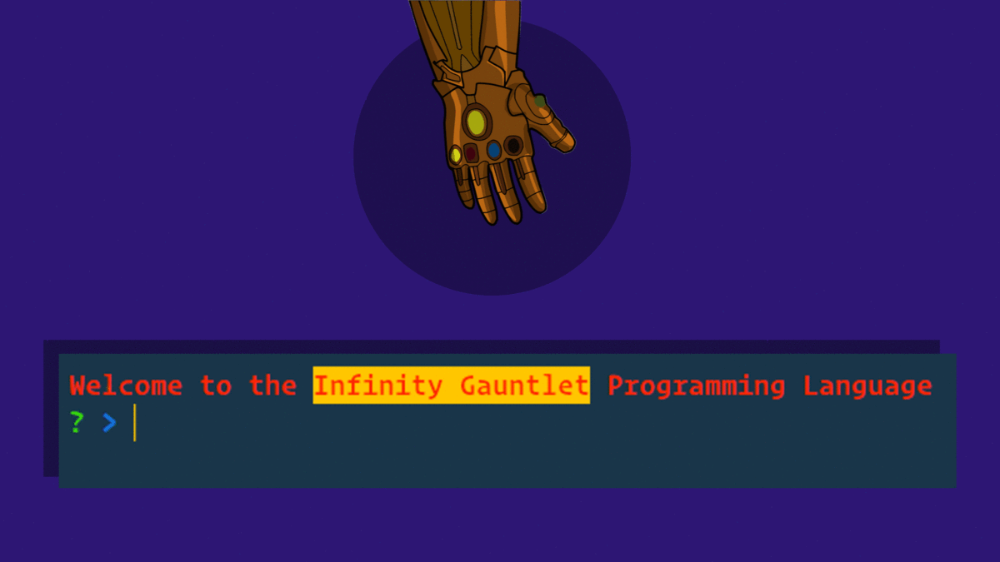

# Infinity Gauntlet ✊ [](https://www.majhirockzz.me/)

My own Lisp-like programming language, using existing JavaScript run-time.

Author | ⚡[Sumesh Majhi](https://github.com/MajhiRockzZ) ⚡ [](https://twitter.com/MajhiRockzZ)
------------ | -------------
Version | 
License | 
Size | 



## Code Example

```
(multiply (add 2 2 (subtract 4 2)))
```

## Filename extension

> filename.ig

## Installation

```bash
git clone https://github.com/MajhiRockzZ/infinity-gauntlet.git

cd infinity-gauntlet

npm install
```

## How to use?

Globally link the directory

 ```bash
 npm link
 ```

**Method I 🍰**

    ```bash
      npm start
    ```

**Method II 🧀**

    ```bash
      infinity-gauntlet
    ```

**Method III 🧃**

    Or make a file with `.ig` file extension and run the below command in `infinity-gauntlet` directory.

    ```bash
      infinity-gauntlet run filename.ig
    ```


## Tech/framework used

* [Chalk ](https://github.com/chalk/chalk)
* [Jest](https://jestjs.io/)

## Team

This project is maintained by the following person(s) and a bunch of [awesome contributors](https://github.com/MajhiRockzZ/infinity-gauntlet/graphs/contributors).

[](https://github.com/MajhiRockzZ) |
:---: |
[Sumesh Majhi](https://github.com/MajhiRockzZ) |

### Contact / Social Media

#### *Get the latest News about Web Development, Open Source, JavaScript & React*

[](https://www.twitter.com/MajhiRockzZ)
[](https://www.facebook.com/sumesh.majhi.5)
[](https://github.com/MajhiRockzZ)

## License

This work by [Sumesh Majhi](https://www.twitter.com/MajhiRockzZ) is licensed under a  [MIT License](https://github.com/MajhiRockzZ/infinity-gauntlet/blob/master/LICENSE)

MIT © [MajhiRockzZ](https://www.twitter.com/MajhiRockzZ)
